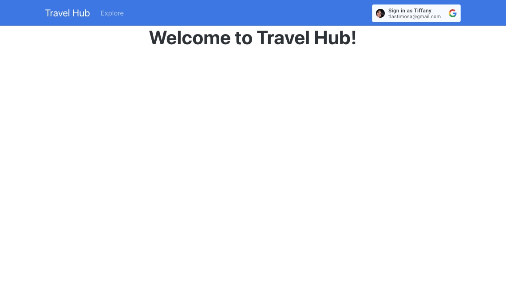
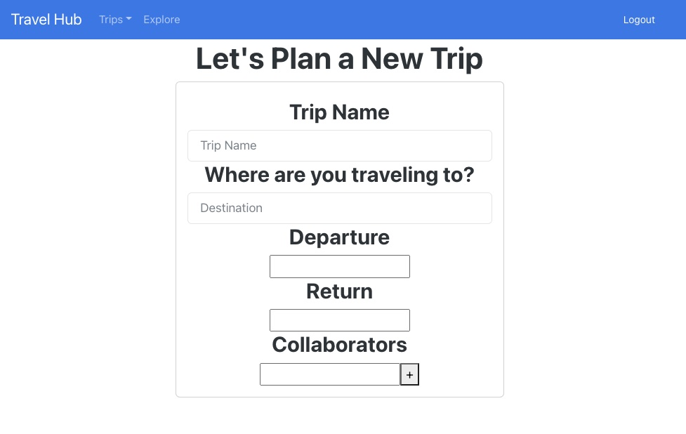
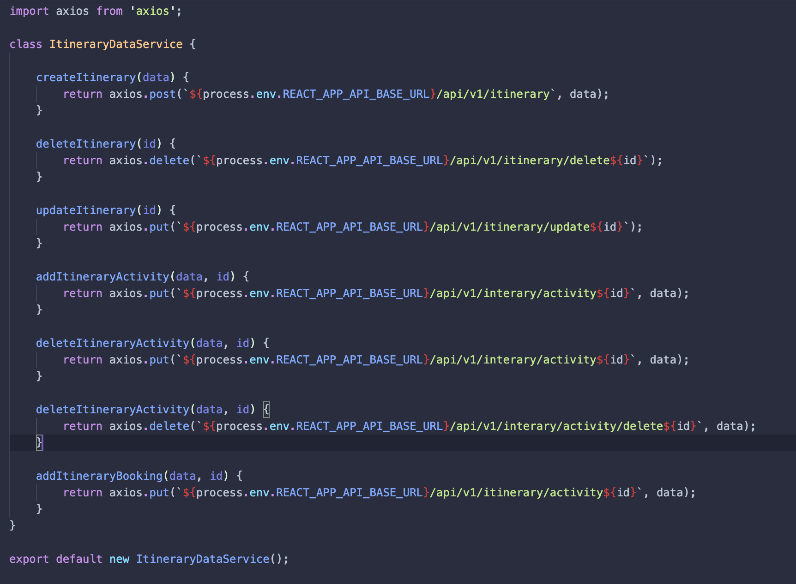
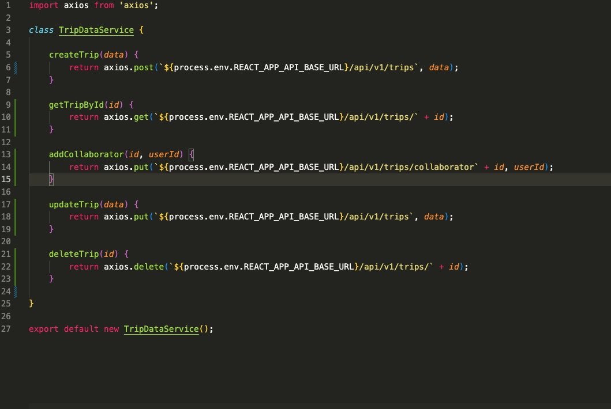
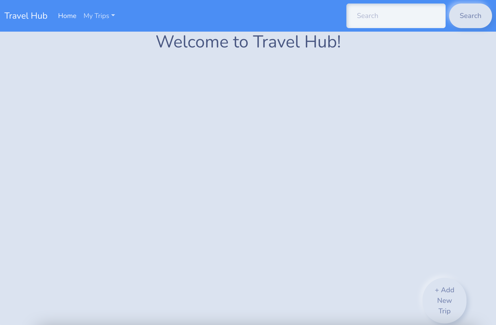
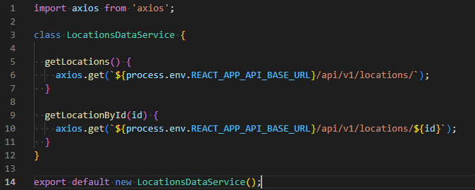

# Travel Hub Frontend
### <b>Collaborators: Tiffany Lastimosa, Ian Gerbec, and Lena Duong</b>
 

Link to [frontend heroku](https://travelhub-frontend-emerald.herokuapp.com/)

**Goal:** 

The goal for this web application is to provide a platform where a user can easily coordinate with friends, family members, and others to coordinate activities given their travel destination.

**User Needs:** 

- To have a shared itinerary, that each user with access to the itinerary can update.
- To view activities based on travel destination.
- Propose and agree to activities amongst users.
- Shared packing list that each user can update. (i.e. If a user books a swimming activity, the user will then update the shared packing list to let other users know to pack a bathing suit and sun block.)
 

# Iteration 2

## Team Contribution

### Tiffany

- Added the Google Login API
- Implemented code so when user logs in the Trips tab appears and when the user logs out the Trips tab disappears
- Created Form to start using for the POST create trips request
    - Form includes drop down calendar for departure and return
    - Form also includes dynamic list
- Added functionality so that when a user logs out when working on a form it redirects the user to the landing page

### Lena
- Created Itinerary in the axios.
- Searched and started implementing the itinerary component in itinerary.js
    - Itinerary component has a calendar where user can view their activities agenda
- Implemented trips dropdown feature and bootstrap theme in apps.js
- Revised README.md
- Deployed frontend to heroku

### Ian

- Added functionality so that locations are now displayed in the “explore” tab
    - Displayed as cards with the city name, country and continent
    - Also displays a link to explore that location
    - Still need to add functionality to display an image in the card itself
- Added to Location.js so that it now gets the correct information from Locations.js
    - Location.js currently displays just the name of the city, but this will be flushed out further over the coming days to include the activities for the location

# Iteration 1

Below is a list of the libraries used. 

## Packages Installed
- Axios: To connect to the backend
- Bootstrap: For design and components
- Bootswatch: Design of the webpage
- React Router: Routing links

For future use:
- Syncfusion: scheduling functionality 
- Tailwind: locations / activities gallery

## Team Contribution

Together we worked on finding the 3rd party libraries to create our website.

### Tiffany
- Implemented trips.js to make calls to api to interact with the database.
- Implemented Trips.js, which is the component that will be used to render the state.

*Code for trip services*

### Lena 
- Started creating a landing page as LandingPage.js
- Wrote README.md for frontend
- Deployed heroku frontend

*Landing page when frontend is runnning*

### Ian
- Implemented locations.js to make calls to the api and interact with the database.
- Implemented Locations.js, a component which will later to be used to render the state of multiple locations
- Implemented Location.js, a component which will later be use to render the state of a specific location

*Code for locations services*
